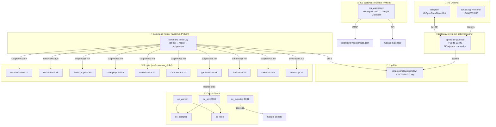

# 🏗️ OpenClaw Stack — Arquitectura V6

> Documento vivo. Última actualización: 2026-03-13.

---

## 1. Vista General



### Principio clave

```
WhatsApp/Telegram → Gateway (transporte) → Log File → Command Router → Scripts → openclaw message send
```

- **Gateway**: solo transporta mensajes. NO ejecuta comandos. `skills/` vacío. `commands.allowFrom = []`.
- **Router**: único ejecutor. Lee el log, detecta `!`, ejecuta bash, responde por el mismo canal.
- **Sin approvals. Sin cloud agent. Sin sandbox. 100% local.**

---

## 2. Servicios Nativos (systemd)

| Servicio | Archivo | Función |
|---|---|---|
| `openclaw-gateway` | `/etc/systemd/system/openclaw-gateway.service` | Transporte WhatsApp/Telegram ↔ Log |
| `command-router` | `/etc/systemd/system/command-router.service` | Ejecuta `!` comandos |
| `ics-watcher` | `/etc/systemd/system/ics-watcher.service` | Auto-agrega ICS de email a Calendar |

---

## 3. Comandos Disponibles (13 total)

| Comando | Script | Qué hace |
|---|---|---|
| `!help` | (inline) | Muestra menú de ayuda |
| `!make-proposal <email> <ctx>` | `make-proposal.sh` | Genera borrador con LLM |
| `!send-proposal <email>` | `send-proposal.sh` | Envía borrador por SMTP |
| `!busca-email <nombre> <apellido> <dominio>` | `enrich-email.sh` | Waterfall: Hunter→Snov→SerpAPI→Permutaciones |
| `!busca-linkedin <tab> <start> <end>` | `linkedin-sheets.sh` | LinkedIn search → Google Sheets |
| `!make-invoice <descripción>` | `make-invoice.sh` | Genera factura PDF (IVA+IRPF) |
| `!send-invoice <ref> [email]` | `send-invoice.sh` | Envía factura por SMTP |
| `!generate-doc <tipo> <contenido>` | `generate-doc.sh` | PDF + DOCX (NDA, SOW, PROPUESTA) |
| `!draft-email <company> <email> ...` | `draft-email.sh` | Email M&A con estilo de Alberto |
| `!calendar-status [query]` | `calendar-status.sh` | Estado de invitaciones |
| `!calendar-create <título> <dt> <emails>` | `calendar-create-event.sh` | Crea evento + envía ICS |
| `!calendar-from-email <query>` | `calendar-from-email.sh` | Extrae ICS del inbox |
| `!calendar-upload <path>` | `calendar-upload-ics.sh` | Sube .ics a Calendar |
| `!admin status\|fix-all\|restart-*` | `admin-ops.sh` | Health check / reinicio |

Ambos canales (WhatsApp y Telegram) funcionan **idéntico**. El router responde por el mismo canal.

---

## 4. Sistema de Facturas

### Flujo `!make-invoice`

```
"!make-invoice 5000 consulting para TechCorp"
  → LLM parsea la solicitud (monto, concepto, cliente)
  → Busca cliente en DB local (data/clients.json)
    → Si no existe: LLM busca datos fiscales → guarda en DB
  → Genera número secuencial (OC-FRA003, OC-FRA004...)
  → Jinja2 + WeasyPrint → PDF profesional
  → Responde con resumen + ruta del PDF
```

### Flujo `!send-invoice`

```
"!send-invoice OC-FRA003"
  → Lee datos del draft (JSON)
  → Adjunta PDF → SMTP (dealflow@nexusfinlabs.com)
  → Confirma envío
```

### Datos del emisor (hardcoded en template)
- **Nombre**: Alberto Jesús Lebrón Lobo
- **CIF**: 09038288-R
- **Dirección**: C/ Taulat 60, 08005 Barcelona
- **Impuestos**: IVA 21% + IRPF 15%

### Archivos
| Archivo | Función |
|---|---|
| `app/templates/factura.html` | Template Jinja2 de factura |
| `ops/invoice_manager.py` | Lógica: parsing, client DB, PDF |
| `data/clients.json` | Base de datos de clientes |
| `data/invoice_counter.json` | Contador secuencial |

---

## 5. ICS Email Watcher

Servicio automático que monitorea el inbox de `dealflow@nexusfinlabs.com` cada **1 minuto**.

```
Email con .ics → IMAP poll → Extrae ICS → Google Calendar API → WhatsApp notification
```

- Trackea UIDs procesados (`/tmp/ics_watcher_processed.json`)
- Solo procesa emails de HOY (no reprocesa históricos)
- Envía notificación a WhatsApp cuando añade un evento

---

## 6. Document Generation (Templates)

| Template | Ruta | Variables clave |
|---|---|---|
| **NDA** | `app/templates/nda.html` | company, jurisdiction, scope |
| **SOW** | `app/templates/sow.html` | phases, timeline, pricing |
| **PROPUESTA** | `app/templates/propuesta.html` | solution, pricing, next_steps |
| **FACTURA** | `app/templates/factura.html` | client, items, IVA, IRPF |

El LLM expande el contexto del usuario en variables JSON → Jinja2 renderiza → WeasyPrint genera PDF.

---

## 7. Email Enrichment Waterfall

```
!busca-email "Nombre" "Apellido" "dominio_o_empresa"
  1. LLM Inference (corrige typos, deduce dominio regional)
  2. Hunter.io API
  3. Snov.io API
  4. Web Scraping (determinista)
  5. SerpAPI Google Search
  6. Permutación (7 patrones) + ZeroBounce validación
```

---

## 8. Docker Stack

| Container | Puerto | Función |
|---|---|---|
| `oc_postgres` | interno | Base de datos principal |
| `oc_redis` | interno | Cola de trabajos |
| `oc_api` | 8000 | Crawler API + Document Generator |
| `oc_worker` | — | Procesador asíncrono |
| `oc_exporter` | 8001 | Google Sheets export |
| `oc_control` | 8081 | Legacy webhook (no usado por Router) |

---

## 9. Config del Gateway

```json
{
  "commands": {
    "allowFrom": {
      "whatsapp": [],
      "telegram": [],
      "*": []
    }
  },
  "tools": {
    "elevated": {
      "allowFrom": {
        "whatsapp": [],
        "telegram": [],
        "*": []
      }
    }
  }
}
```

**`~/.openclaw/workspace/skills/` está VACÍO** — el gateway no tiene skills que ejecutar.

---

## 10. APIs y Credenciales

| API | Uso | Env var |
|---|---|---|
| OpenRouter | LLM (GPT-4o-mini) | `OPENROUTER_API_KEY` |
| Hunter.io | Email discovery | `HUNTER_API_KEY` |
| Snov.io | Email discovery | `SNOVIO_CLIENT_ID` + `SNOVIO_CLIENT_SECRET` |
| ZeroBounce | Email validation | `ZEROBOUNCE_API_KEY` |
| SerpAPI | Google/LinkedIn search | `SERPAPI_KEY` |
| Google Calendar | ICS → Calendar | `GOOGLE_APPLICATION_CREDENTIALS` |
| Google Sheets | LinkedIn → Sheets | `GOOGLE_APPLICATION_CREDENTIALS` |
| IMAP/SMTP | Email (IONOS) | `EMAIL_PASSWORD` |

Todas en `~/openclawd_stack/.env` (nunca en git).

---

## 11. Deployment

```bash
# 1. Local → VPS
scp archivo.py openclawd-vps:/home/albi_agent/openclawd_stack/ops/

# 2. Reiniciar servicio
ssh openclawd-vps "echo 'Achu81!' | sudo -S systemctl restart command-router"

# 3. Git (local + push)
cd ~/Desktop/SW_AI/openclawd-vps && git add -A && git commit -m "msg" && git push origin main
```

### Workflow estándar: cambiar código
1. Editar localmente (`/Users/alberto/Desktop/SW_AI/openclawd-vps/project/openclawd_stack/`)
2. SCP al VPS
3. Reiniciar servicio relevante
4. Git commit + push

---

## 12. Flujos Futuros

| Flujo | Estado | Tech |
|---|---|---|
| 🎨 `!make-ppt` | Planificado | Marp CLI (Markdown→PDF/PPTX) |
| 🌍 Multi-idioma templates | Planificado | EN/DE versions |
| 🔍 Web Monitor | Idea | Hash cada 6h, notifica cambios |
| 📋 CRM Pipeline | Idea | Google Sheets tab con estados |
| 🔄 Auto-Follow-Up | Idea | Cron diario, detecta emails sin respuesta |
