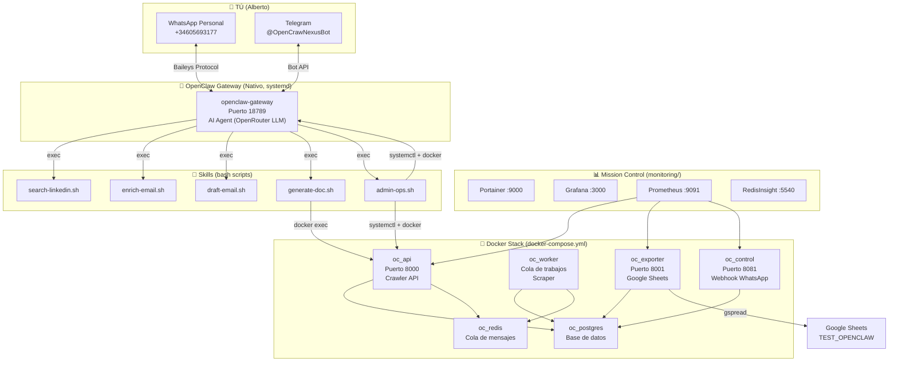
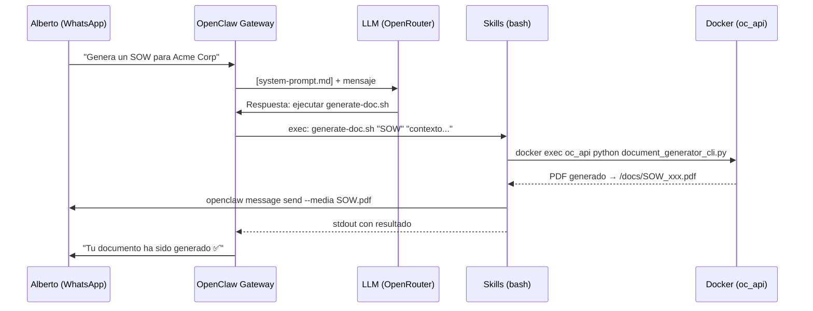
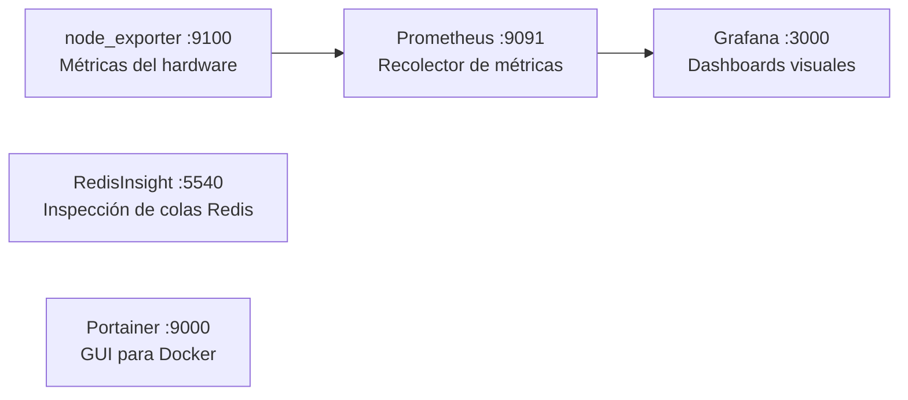
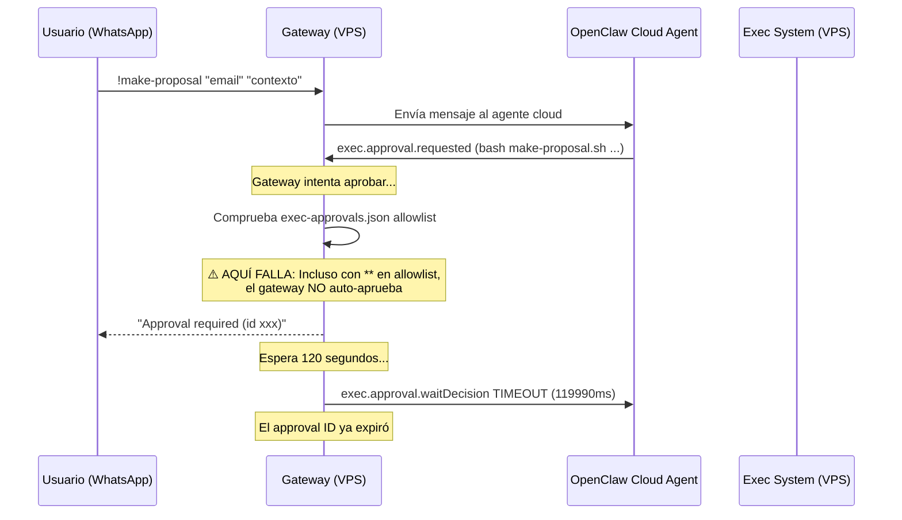

# 🏗️ OpenClaw Stack — Arquitectura Completa

> Documento vivo que explica **qué hace cada pieza**, **cómo se conectan** y **cómo escalar con nuevas skills**.

---

## 1. Vista General (Big Picture)



---

## 2. Servicios Docker — Qué Hace Cada Uno

### 🐘 `oc_postgres` — La Base de Datos

| Campo | Valor |
|---|---|
| **Imagen** | `postgres:16-alpine` |
| **Puerto** | Interno (solo red Docker `ocnet`) |
| **Función** | Almacena TODOS los datos persistentes del sistema |

**Tablas principales:**
- **`pages`** — Cada URL que el crawler ha visitado (título, emails encontrados, teléfonos, formularios)
- **`export_checkpoints`** — Marca hasta qué `page.id` se ha exportado a Google Sheets (evita duplicados)
- **`control_logs`** — Log de todas las interacciones via WhatsApp (quién mandó qué, qué respondió el bot)
- **`email_drafts`** — Borradores de emails generados por el drafter

**Analogía:** Es el **disco duro central** del sistema. Si se pierde, se pierde todo. Por eso tiene un volumen persistente (`oc_pgdata`).

---

### 🔴 `oc_redis` — La Cola de Mensajes

| Campo | Valor |
|---|---|
| **Imagen** | `redis:7-alpine` |
| **Puerto** | Interno |
| **Función** | Cola de trabajos asíncronos (jobs queue) |

**Cómo funciona:**
1. Cuando alguien pide *"scrape esta URL"* o *"busca en LinkedIn"*, el trabajo se **encola** en Redis
2. El `oc_worker` **desencola** y procesa uno por uno
3. Redis también guarda datos temporales de sesión

**Analogía:** Es el **buzón de tareas**. Tú dejas el sobre, y el cartero (worker) lo recoge cuando puede.

---

### 🌐 `oc_api` — La API del Crawler (Puerto 8000)

| Campo | Valor |
|---|---|
| **Build** | `./app/Dockerfile` |
| **Framework** | FastAPI (Python) |
| **Puerto** | `8000` |

**Endpoints:**
| Ruta | Método | Qué hace |
|---|---|---|
| `/health` | GET | Comprueba si DB + Redis están vivos |
| `/jobs` | POST | Encola una URL para scraping → Redis |
| `/pages` | GET | Lista las páginas ya scrapeadas |

**También contiene:**
- `document_generator_cli.py` — El motor de generación de PDFs (WeasyPrint)
- `templates/` — Plantillas Jinja2 para documentos (base.html, contract.html)
- `email_drafter.py` — Motor de redacción de emails con estilo de Alberto

**Analogía:** Es la **recepción** del sistema. Acepta peticiones del exterior y las enruta.

---

### ⚙️ `oc_worker` — El Procesador Asíncrono

| Campo | Valor |
|---|---|
| **Build** | Mismo `./app/Dockerfile` que `oc_api` |
| **Comando** | `python worker.py` |
| **Puerto** | Ninguno (solo consume de Redis) |

**Qué hace:**
1. Escucha la cola `jobs:queue` de Redis en un bucle infinito
2. Saca un trabajo (URL a scrappear)
3. Descarga la página con `requests` + `BeautifulSoup`
4. Extrae emails, teléfonos, formularios
5. Guarda el resultado en Postgres (`pages`)
6. Reintenta hasta 3 veces con backoff si falla

**Analogía:** Es el **obrero de la fábrica**. No habla con nadie, solo trabaja procesando lo que le dejan en la cola.

---

### 📊 `oc_exporter` — El Exportador a Google Sheets (Puerto 8001)

| Campo | Valor |
|---|---|
| **Build** | `./exporter/Dockerfile` |
| **Framework** | FastAPI (Python) |
| **Puerto** | `8001` |

**Endpoints:**
| Ruta | Método | Qué hace |
|---|---|---|
| `/health` | GET | Comprueba DB + conexión con Sheets |
| `/status` | GET | Muestra hasta qué ID se ha exportado |
| `/export/pages` | POST | Exporta páginas nuevas a la pestaña `companies` |
| `/export/events` | POST | Escribe un evento snapshot en la pestaña `events` |

**Mecanismo de checkpoints:** Usa la tabla `export_checkpoints` para saber cuál fue el último `page.id` exportado. Solo envía las nuevas. Nunca duplica.

**Analogía:** Es el **contable** que coge datos del almacén (Postgres) y los pasa a la hoja de Excel (Google Sheets) sin repetir nada.

---

### 🎛️ `oc_control` — El Webhook de WhatsApp (Puerto 8081)

| Campo | Valor |
|---|---|
| **Build** | `./control/Dockerfile` |
| **Framework** | FastAPI (Python) |
| **Puerto** | `8081` |

**Endpoints:**
| Ruta | Método | Qué hace |
|---|---|---|
| `/health` | GET | Comprueba DB |
| `/whatsapp` | POST | Recibe webhooks de OpenClaw Gateway |

**Comandos que entiende (modo legacy):**
`help`, `status`, `pages`, `health`, `export`, `scrape <url>`, `logs`

**Seguridad:** Solo responde a números en la whitelist (`ALLOWED_NUMBERS`). Todo queda logueado en `control_logs`.

**Analogía:** Es el **portero** que escucha quién llama por WhatsApp y ejecuta comandos internos.

---

## 3. OpenClaw Gateway — El Cerebro IA

> **NO es un contenedor Docker.** Corre como servicio nativo de systemd.



**Componentes clave:**
| Componente | Ruta |
|---|---|
| Binario | `~/.nvm/.../node openclaw.mjs gateway` |
| Config | `~/.openclaw/openclaw.json` |
| System Prompt | `~/.openclaw/agents/main/agent/system-prompt.md` |
| Skills | `~/.openclaw/workspace/skills/` |
| Docs generados | `~/.openclaw/workspace/docs/` |

**Canales LLM:**
- **Primario:** OpenRouter (auto/balanced)
- **Fallback:** OpenAI (gpt-4.1-mini / gpt-4o-mini)

---

## 4. Mission Control — Monitoring Stack



| Servicio | Qué hace | Cuándo lo usas |
|---|---|---|
| **Portainer** | GUI web para ver/reiniciar containers | Cuando quieres ver qué Docker está up/down sin terminal |
| **Grafana** | Dashboards de métricas sobre CPU, RAM, disco | Para monitoring a largo plazo y alertas |
| **Prometheus** | Recolecta métricas cada X segundos | Backend de Grafana (no lo tocas directamente) |
| **RedisInsight** | GUI para ver qué hay en la cola de Redis | Debug: ver si hay jobs pendientes, ver las keys |
| **node_exporter** | Exporta métricas del SO (CPU, RAM, red) | Backend de Prometheus (no lo tocas directamente) |

**Acceso:** Todo vía Tailscale IP `http://100.71.50.105:<puerto>`

---

## 5. Skills — Tu Arsenal de Automatización

Cada skill es un **script bash** en `~/.openclaw/workspace/skills/`. El LLM los ejecuta cuando le enseñas en el `system-prompt.md` cuándo usarlos.

### Skills Actuales

| Script | Trigger (lo que dices) | Qué hace |
|---|---|---|
| `search-linkedin.sh` | *"busca linkedin payments 5"* | Busca perfiles en LinkedIn vía SerpAPI → Redis |
| `enrich-email.sh` | *"busca el email de Juan..."* | Waterfall: Hunter → Snov.io → Scraping → SerpAPI |
| `make-proposal.sh` | *"prepara una propuesta..."* | Genera borrador profesional con LLM (Gemini 2.0 Flash) |
| `send-proposal.sh` | *"envía la propuesta"* | Despacha el borrador vía SMTP (IONOS Dealflow) |
| `calendar-create-event.sh` | *"reserva mañana a las 16h..."* | Crea .ics, envía invitación y mete en Google Calendar |
| `calendar-status.sh` | *"status invitación Global"* | Consulta si los invitados han aceptado o rechazado |
| `calendar-from-email.sh` | *"busca invitación de Juan"* | Busca .ics en inbox y lo añade al calendario |
| `calendar-upload-ics.sh` | *(sube archivo .ics)* | Procesa .ics subido y lo mete en el calendario |
| `draft-email.sh` | *(legacy M&A)* | Redacta email con estilo de Alberto vía LLM |
| `generate-doc.sh` | *"genera el PDF final"* | WeasyPrint PDF → `openclaw message send --media` |
| `admin-ops.sh` | *"status"* / *"fix-all"* | Health check, restart gateway/docker |

### 🚀 Cómo Crear una Skill Nueva

**Paso 1: Crea el script bash**
```bash
# Ejemplo: ops/openclaw_skills/mi-nueva-skill.sh
#!/bin/bash
# Mi Nueva Skill — hace algo increíble
# Usage: ./mi-nueva-skill.sh "argumento1" "argumento2"

arg1=$1
arg2=$2

# Tu lógica aquí (puede llamar a Python, Docker, APIs, etc.)
echo "Resultado: hice algo con $arg1 y $arg2"
```

**Paso 2: Hazlo ejecutable y despliega**
```bash
chmod +x ops/openclaw_skills/mi-nueva-skill.sh
./deploy.sh  # rsync al VPS
```

**Paso 3: Symlink en el workspace de OpenClaw**
```bash
ssh openclawd-vps 'ln -sf ~/openclawd_stack/ops/openclaw_skills/mi-nueva-skill.sh \
  ~/.openclaw/workspace/skills/mi-nueva-skill.sh'
```

**Paso 4: Enseña a OpenClaw a usarla (system-prompt.md)**
```markdown
### 🆕 MI NUEVA SKILL
Cuando Alberto te pida "hacer algo increíble", ejecuta:
\```bash
~/.openclaw/workspace/skills/mi-nueva-skill.sh "arg1" "arg2"
\```
```

**Paso 5: Sube el prompt al VPS**
```bash
scp /tmp/system-prompt.md openclawd-vps:~/.openclaw/agents/main/agent/system-prompt.md
```

---

## 6. Flujos de Datos (consolidados)

### Flujo 1: Web Crawling → Postgres → Sheets
```
!~/.openclaw/workspace/skills/scrape-url.sh "https://acme.com"
  → oc_api → Redis → oc_worker → BeautifulSoup
    → Postgres → oc_exporter → Google Sheets ✅
```

### Flujo 2: LinkedIn Profile Search → Sheets
```
!busca-linkedin vc_payments 4 32
  → linkedin_search.py → SerpAPI
    → Lee empresas del Sheet → Busca LinkedIn profiles
      → Escribe URLs directamente en Google Sheets ✅
```

### Flujo 3: Inteligencia de Email Enricher (LLM + Waterfall)
```
!busca-email "Silvia" "Fray" "EY"
  → email_enricher.py → Flujo Inteligente:
    1. [LLM Inference]: Si no hay dominio, SerpAPI busca snippets de LinkedIn → OpenRouter (GPT-4o-mini) deduce el país, corrige typos en el nombre (Fray -> Frau), y deduce el dominio reginal (ej. it.ey.com)
    2. Hunter.io API (usando el nombre corregido y dominio exacto)
    3. Web Scraping (fallback determinista)
    4. SerpAPI Google Search (fallback determinista)
    5. Permutación (7 patrones) + ZeroBounce
  → `openclaw message send` → Envío directo a WhatsApp (bypass del gateway) ✅
```

### Flujo 4: Document Generation (PDF + DOCX → WhatsApp)
```
"genera un SOW para Acme" (vía chat normal, NO necesita !)
  → LLM redacta → generate-doc.sh
    → WeasyPrint → PDF + python-docx → DOCX
      → openclaw message send → WhatsApp 📎 ✅
```

### Flujo 5: Email Drafting (M&A / Sales / Outreach)
```
"genera un borrador M&A para John en Acme" (vía chat normal)
  → draft-email.sh → email_drafter.py
    → LLM + style_guide → Borrador en Postgres
      → Alberto aprueba → SMTP → ✅
```

### Flujo 6: Admin Self-Healing
```
!~/.openclaw/workspace/skills/admin-ops.sh fix-all
  → openclaw gateway stop → systemctl start (Node v22)
  → docker compose restart → Health check → ✅
```

---

## 7. Flujos Futuros (de fácil a difícil)

| # | Flujo | Dificultad | Descripción |
|---|---|---|---|
| 7 | 🧾 Invoice/Factura | ⭐ | Plantilla Jinja2 + cálculo IVA → PDF/DOCX → WhatsApp |
| 8 | 🌍 Multi-Idioma Docs | ⭐ | Templates NDA/SOW en EN/DE |
| 9 | 🔍 Web Monitor | ⭐⭐ | Hash web cada 6h, notifica si cambia |
| 10 | 📋 CRM Pipeline | ⭐⭐ | Pestaña 'pipeline' en Sheets con estados de leads |
| 11 | 📅 Meeting Scheduler | ⭐⭐⭐ | Cal.com API → proponer slots desde chat |
| 12 | 🔄 Auto-Follow-Up | ⭐⭐⭐ | Cron diario → detecta emails sin respuesta → genera follow-ups |
| 13 | 🧠 RAG Knowledge Base | ⭐⭐⭐⭐ | Embeddings de PLANTILLAS_V5 → búsqueda semántica |

---

## 8. 📱 Comandos por WhatsApp / Telegram

### Modo `!` (Bash Directo — Bypassa el LLM)
Prefijo `!` = ejecuta el comando directamente SIN pasar por el LLM.
Los scripts en `~/bin/busca-*` y `~/.openclaw/workspace/skills/**` están auto-aprobados.

| Escribe esto en el chat | Qué hace |
|---|---|
| `!busca-linkedin vc_payments 4 32` | Busca LinkedIn para empresas en filas 4-32 del tab `vc_payments` y escribe URLs en el Sheet |
| `!busca-linkedin pharma 2` | Busca LinkedIn para TODAS las empresas del tab `pharma` desde fila 2 |
| `!busca-email "Javier" "Santiago" "bms.com"` | Busca el email corporativo de Javier Santiago en bms.com |
| `!busca-email "Albert" "Palà Creus" "apcengineeringservices.com"` | Busca email con dominio (mejor si lo conoces) |
| `!busca-email "Dave" "Wang" "Wall Street Prompt"` | Busca email por nombre de empresa (infiere el dominio) |
| `!~/.openclaw/workspace/skills/admin-ops.sh status` | Estado completo del sistema |
| `!~/.openclaw/workspace/skills/admin-ops.sh fix-all` | Reinicia gateway + Docker (arregla todo) |
| `!~/.openclaw/workspace/skills/admin-ops.sh restart-gateway` | Solo reinicia el gateway |

### Formato del comando de Email
```
!busca-email "NOMBRE" "APELLIDO" "empresa_o_dominio"
```
- Los 3 argumentos van entre comillas `""`
- Si conoces el dominio (ej: `bms.com`), úsalo directamente
- Si no, pon el nombre de empresa (ej: `"Bristol-Myers Squibb"`) y el script infiere el dominio

### Formato del comando de LinkedIn
```
!busca-linkedin <tab_name> <fila_inicio> [fila_fin]
```
- `tab_name` = nombre de la pestaña en Google Sheets (TEST_OPENCLAW)
- `fila_inicio` y `fila_fin` son filas del Sheet (sin comillas)
- Si omites `fila_fin`, busca desde `fila_inicio` hasta el final

### Modo Chat Normal (pasa por el LLM)
Estos SÍ funcionan sin `!` porque el LLM no los bloquea:

| Escribe esto en el chat | Qué hace |
|---|---|
| `genera un NDA para Acme Corp` | Genera NDA en PDF + DOCX y lo envía al chat |
| `genera un borrador M&A para John de Acme` | Redacta email de outreach en tu estilo |
| `estado del sistema` | El bot ejecuta admin-ops.sh status |

---

## 9. Modelo LLM y Fallback

```
🥇 Primary:  Claude Opus 4.6  (anthropic/claude-opus-4-6)
🥈 Fallback: GPT-5.4          (openai/gpt-5.4)
🥉 Último:   OpenRouter Auto   (openrouter/auto)
```

### APIs de Enriquecimiento

| API | Uso | Gratuito |
|---|---|---|
| Hunter.io | Email discovery | 25 búsquedas/mes |
| ZeroBounce | Validar emails (SMTP ping) | 100/mes |
| SerpAPI | Google Search (LinkedIn + emails) | 100/mes |
| Apollo | Email discovery | ❌ Bloqueado (plan free) |

---

## 10. Comandos Útiles — Referencia Completa

### 10.1 Comandos `!` (Bash directo desde WhatsApp / Telegram)

> **Regla:** `!` al inicio = bash directo. No pasa por el LLM. No hay excusas ni refusals.

#### 🔍 LinkedIn → Sheets
```bash
# Buscar LinkedIn de empresas en pestaña vc_payments, filas 4 a 32
!busca-linkedin vc_payments 4 32

# Buscar LinkedIn solo de filas 4 a 6
!busca-linkedin vc_payments 4 6

# Buscar LinkedIn de todas las empresas en pestaña pharma desde fila 2
!busca-linkedin pharma 2

# Buscar LinkedIn de pestaña payments, filas 10 a 20
!busca-linkedin payments 10 20
```

#### 📧 Email Discovery
```bash
# Buscar email con dominio conocido
!busca-email "Javier" "Santiago" "bms.com"

# Buscar email con nombre de empresa (infiere dominio)
!busca-email "Albert" "Palà Creus" "APC Engineering Services"
!busca-email "Dave" "Wang" "Wall Street Prompt"
!busca-email "María" "García" "Santander"
!busca-email "Juan" "Pérez" "acme.com"

# ⚠️ IMPORTANTE: los 3 argumentos SIEMPRE entre comillas ""
```

#### 🔧 Admin / Sistema
```bash
# Estado completo (Docker + APIs + Gateway)
!~/.openclaw/workspace/skills/admin-ops.sh status

# Reiniciar TODO (gateway + Docker)
!~/.openclaw/workspace/skills/admin-ops.sh fix-all

# Solo reiniciar gateway
!~/.openclaw/workspace/skills/admin-ops.sh restart-gateway

# Solo reiniciar Docker
!~/.openclaw/workspace/skills/admin-ops.sh restart-docker

# Solo reiniciar oc_api
!~/.openclaw/workspace/skills/admin-ops.sh restart-api
```

#### 📄 Documentos (también funcionan con !)
```bash
# Generar un NDA manualmente vía bash
!~/.openclaw/workspace/skills/generate-doc.sh "NDA" "contenido del NDA..."

# Exportar datos a Google Sheets
!~/.openclaw/workspace/skills/export-sheets.sh
```

### 10.2 Skills disponibles (`/skills`)

Las skills se invocan desde chat escribiendo el nombre. OpenClaw las detecta automáticamente:

| Skill | Ubicación | Descripción |
|---|---|---|
| `admin-ops.sh` | symlink → `ops/openclaw_skills/` | Estado, restart, fix-all |
| `generate-doc.sh` | symlink → `ops/openclaw_skills/` | Genera PDF + DOCX |
| `enrich-email.sh` | `skills/` | Email enricher (waterfall) |
| `draft-email.sh` | `skills/` | Borrador de email M&A/Sales |
| `linkedin-sheets.sh` | symlink → `ops/openclaw_skills/` | LinkedIn → Sheets |
| `busca-email` | `~/bin/` | Atajo para email enricher |
| `busca-linkedin` | `~/bin/` | Atajo para LinkedIn sheets |

Para ver todas las skills instaladas:
```bash
ssh openclawd-vps 'export PATH="/home/albi_agent/.nvm/versions/node/v22.22.0/bin:$PATH" && openclaw skills list'
```

### 10.3 Terminal / SSH (desde Mac)

```bash
# ═══════════ DEPLOYMENT ═══════════
# Desplegar cambios (rsync + docker rebuild + restart gateway)
cd ~/Desktop/SW_AI/openclawd-vps/project && ./deploy.sh

# Solo subir el system prompt (sin rebuild Docker)
scp /tmp/system-prompt.md openclawd-vps:~/.openclaw/agents/main/agent/system-prompt.md

# ═══════════ GATEWAY ═══════════
# Reiniciar gateway correctamente (SIEMPRE con Node v22)
ssh openclawd-vps 'export PATH="/home/albi_agent/.nvm/versions/node/v22.22.0/bin:$PATH" && openclaw gateway stop; sleep 2 && sudo systemctl start openclaw-gateway'

# Ver logs del gateway en tiempo real
ssh openclawd-vps 'sudo journalctl -u openclaw-gateway -f'

# Ver modelo actual
ssh openclawd-vps 'grep -o "primary.*" ~/.openclaw/openclaw.json | head -1'

# ═══════════ DOCKER ═══════════
# Ver estado de todos los containers
ssh openclawd-vps 'sudo docker ps --format "table {{.Names}}\t{{.Status}}"'

# Ver logs de un container
ssh openclawd-vps 'sudo docker logs oc_api --tail 50'
ssh openclawd-vps 'sudo docker logs oc_worker --tail 50'

# Rebuild un servicio específico
ssh openclawd-vps 'cd ~/openclawd_stack && sudo docker compose up -d --build oc_api'

# ═══════════ DATABASE ═══════════
# Consulta directa a Postgres
ssh openclawd-vps 'sudo docker exec oc_postgres psql -U openclawd -d openclawd -c "SELECT count(*) FROM pages;"'

# Ver últimos emails encontrados
ssh openclawd-vps 'sudo docker exec oc_postgres psql -U openclawd -d openclawd -c "SELECT * FROM email_results ORDER BY created_at DESC LIMIT 10;"'

# ═══════════ SCRIPTS DIRECTOS ═══════════
# Ejecutar email enricher desde SSH (igual que !busca-email)
ssh openclawd-vps 'cd ~/openclawd_stack && source .env && python3 ops/email_enricher.py "Javier" "Santiago" "bms.com"'

# Ejecutar LinkedIn search desde SSH
ssh openclawd-vps 'cd ~/openclawd_stack && source .env && GOOGLE_APPLICATION_CREDENTIALS=/home/albi_agent/.secrets/google/credentials.json python3 ops/linkedin_search.py --tab vc_payments --start-row 4 --end-row 6'

# ═══════════ API KEYS ═══════════
# Ver todas las API keys configuradas (ofuscadas)
ssh openclawd-vps 'grep -E "API_KEY|SERPAPI" ~/openclawd_stack/.env | sed "s/=.*/=***/"'

# Cambiar modelo LLM (se aplica en caliente, sin reiniciar)
ssh openclawd-vps 'export PATH="/home/albi_agent/.nvm/versions/node/v22.22.0/bin:$PATH" && openclaw config set agents.defaults.model.primary "anthropic/claude-opus-4-6"'
```

---

## 11. ⚠️ ESTRATEGIA ACTUAL: Sistema de Aprobaciones (EXEC APPROVALS)

> **Estado al 2026-03-12**: Los comandos `!make-proposal` y `!send-proposal` **FUNCIONAN desde terminal SSH** pero **NO desde WhatsApp/Telegram** debido al sistema de aprobaciones de OpenClaw.

### 11.1 Lo que FUNCIONA ✅

| Escenario | Estado | Evidencia |
|---|---|---|
| `make-proposal.sh` desde VPS terminal | ✅ FUNCIONA | Message ID: `3EB081D4405D1095E26B56` |
| `send-proposal.sh` desde VPS terminal | ✅ FUNCIONA | `SUCCESS: Proposal sent to dealflow@nexusfinlabs.com` |
| `proposal_manager.py --make` genera contenido específico | ✅ FUNCIONA | GPT-4o-mini, temperature 0.9, firma Alberto L. |
| SMTP via `dealflow@nexusfinlabs.com` | ✅ FUNCIONA | IONOS SMTP SSL:465 |
| `openclaw message send` desde terminal | ✅ FUNCIONA | Envía mensajes a WhatsApp correctamente |

### 11.2 Lo que NO FUNCIONA ❌

| Escenario | Problema |
|---|---|
| `!make-proposal` desde WhatsApp | "Approval required (id xxx). Approve to run" |
| `!send-proposal` desde WhatsApp | Mismo bloqueo de aprobación |
| `/approve <id> allow-always` | "Failed to submit approval: Error: unknown approval id" (timeout 120s) |

### 11.3 Cómo funciona el flujo de ejecución de OpenClaw



### 11.4 Todo lo que hemos intentado (y NO funcionó)

| Intento | Config | Resultado |
|---|---|---|
| `exec.security: "full"` + `exec.ask: "off"` | `openclaw.json` | ❌ Sigue pidiendo aprobación |
| `exec.security: "allowlist"` + patterns `**` | `exec-approvals.json` | ❌ Sigue pidiendo aprobación |
| 8 patterns de allowlist (bash*, full paths, **) | `exec-approvals.json` | ❌ Sigue pidiendo aprobación |
| `exec.host: "gateway"` (ejecutar local, no en sandbox cloud) | `openclaw.json` | ❌ Causó crash-loop del gateway |
| Approval Daemon (socket Unix auto-aprobando) | `approval-daemon.py` + systemd | ❌ Gateway nunca conectó al socket |
| `/approve <id> allow-always` desde WhatsApp | Respuesta manual del usuario | ❌ "unknown approval id" (timeout) |
| Eliminar `exec-approvals.json` completamente | Sin archivo | ❌ Sigue pidiendo aprobación |

### 11.5 Archivos clave del sistema de aprobaciones

| Archivo | Ruta en VPS | Función |
|---|---|---|
| Config gateway | `~/.openclaw/openclaw.json` | `tools.exec.security`, `tools.exec.ask` |
| Allowlist | `~/.openclaw/exec-approvals.json` | Patrones de auto-aprobación |
| Socket daemon | `~/.openclaw/exec-approvals.sock` | Socket Unix para auto-aprobar |
| Golden backup | `~/openclawd_stack/ops/exec-approvals-golden.json` | Copia con 4 patterns |
| Gateway config backup | `~/.openclaw/openclaw.json.bak` | Config original que funcionaba antes de nuestros cambios |

### 11.6 Valores válidos de `exec.security` (de la documentación oficial)

| Valor | Significado |
|---|---|
| `deny` | Bloquea TODA ejecución de comandos |
| `allowlist` | Solo permite comandos en la allowlist |
| `full` | Permite TODO (equivalente a elevated) — más permisivo |

### 11.7 Valores válidos de `exec.ask`

| Valor | Significado |
|---|---|
| `off` | Nunca preguntar al usuario |
| `on-miss` | Preguntar solo cuando no está en la allowlist |
| `always` | Preguntar siempre |

### 11.8 Otros ajustes relevantes descubiertos en la documentación

| Ajuste | Significado |
|---|---|
| `tools.exec.host` | `sandbox` (default) = cloud. `gateway` = local. **IMPORTANTE:** `gateway` causó crash-loop |
| `askFallback` | Qué hacer si `ask` falla: `deny`, `allowlist`, `full` |
| `autoAllowSkills` | ❓ Podría auto-aprobar skills registradas (NO probado aún) |
| `/exec security=full ask=off` | Override de sesión por chat (NO probado aún) |

### 11.9 🎯 NUEVA ESTRATEGIA PROPUESTA

> **Objetivo:** Eliminar la dependencia del sistema de aprobaciones del agente cloud de OpenClaw.

**Opción A — Override de sesión (SIMPLE, probar primero)**
El usuario escribe UNA VEZ en el chat:
```
/exec security=full ask=off
```
Esto sobreescribe la configuración de la sesión actual. Si funciona, es la solución más rápida.

**Opción B — `autoAllowSkills` (NO probado)**
La documentación menciona que skills registradas como CLIs pueden auto-aprobarse:
```json
{ "tools": { "exec": { "autoAllowSkills": true } } }
```
Requiere que las skills estén correctamente registradas en el workspace.

**Opción C — Message Watcher propio (BYPASS TOTAL)**
Crear un servicio Python que:
1. Escucha mensajes entrantes de WhatsApp/Telegram via la API del gateway
2. Cuando detecta `!make-proposal`, `!send-proposal`, etc.
3. Ejecuta los scripts directamente con `subprocess.run()`
4. Envía el resultado de vuelta con `openclaw message send`
5. **Bypassa completamente** el agente cloud y el sistema de aprobaciones

**Recomendación:** Probar A primero (5 segundos). Si falla → B (5 minutos). Si falla → C (30 minutos).

### 11.10 Config actual del gateway restaurada

```json
{
  "tools": {
    "exec": {
      "security": "full",
      "ask": "off"
    },
    "elevated": {
      "allowFrom": {
        "whatsapp": ["34605693177@s.whatsapp.net"],
        "telegram": ["7024795874"],
        "*": ["*"]
      }
    }
  },
  "agents": {
    "defaults": {
      "elevatedDefault": "full"
    }
  }
}
```

### 11.11 Comando de reinicio del gateway (ORDEN CORRECTO)

```bash
# 1. Parar el gateway limpiamente
ssh openclawd-vps 'systemctl --user stop openclaw-gateway'

# 2. Matar TODOS los procesos huérfanos
ssh openclawd-vps 'ps aux | grep -E "openclaw" | grep -v grep | grep -v postgres | awk "{print \$2}" | xargs kill -9 2>/dev/null'

# 3. Esperar a que el cloud suelte la conexión WebSocket
sleep 5

# 4. Resetear el servicio y arrancar limpio
ssh openclawd-vps 'systemctl --user reset-failed openclaw-gateway; systemctl --user start openclaw-gateway'

# 5. Verificar (WhatsApp debe decir "Listening for personal WhatsApp inbound messages")
ssh openclawd-vps 'sleep 8; journalctl --user -u openclaw-gateway --since "now" --no-pager | grep -i whatsapp'
```

### 11.12 `proposal_manager.py` — Versión Canónica

- **Localización:** `ops/proposal_manager.py` (una sola versión, local + VPS sincronizados)
- **API:** OpenAI SDK → `gpt-4o-mini` (temperature 0.9)
- **SMTP:** `dealflow@nexusfinlabs.com` via IONOS (465 SSL)
- **BCC:** `dealflow@nexusfinlabs.com`
- **Firma:** Alberto L. / Tech Advisor / dealflow@nexusfinlabs.com
- **Nunca** usa `hola@movildrive.com` — ese es email personal de Alberto
