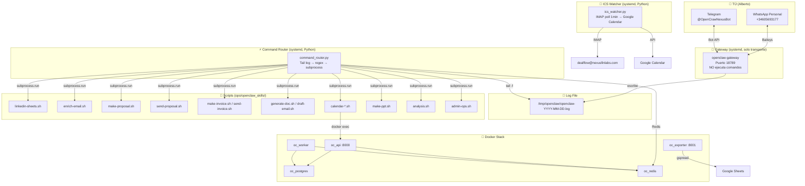

# 🏗️ OpenClaw Stack — Arquitectura V8

> Documento vivo. Última actualización: 2026-03-13.

---

## 1. Vista General



### Principio clave

```
WhatsApp/Telegram → Gateway (transporte) → Log File → Command Router → Scripts → openclaw message send
```

- **Gateway**: solo transporta mensajes. NO ejecuta comandos. `skills/` vacío. `commands.allowFrom = []`.
- **Router**: único ejecutor. Lee el log, detecta `!`, ejecuta bash, responde por el mismo canal.
- **Sin approvals. Sin cloud agent. Sin sandbox. 100% local.**

---

## 2. Servicios Nativos (systemd)

| Servicio | Archivo | Función |
|---|---|---|
| `openclaw-gateway` | `/etc/systemd/system/openclaw-gateway.service` | Transporte WhatsApp/Telegram ↔ Log |
| `command-router` | `/etc/systemd/system/command-router.service` | Ejecuta `!` comandos |
| `ics-watcher` | `/etc/systemd/system/ics-watcher.service` | Auto-agrega ICS de email a Calendar |
| `linkedin-worker` | `ops/linkedin_worker.py` | Procesa jobs LinkedIn async (Redis queue) |

---

## 3. Comandos Disponibles (17 total)

| Comando | Script | Qué hace |
|---|---|---|
| `!help` | (inline) | Muestra menú de ayuda |
| `!context <texto>` | (inline → Redis) | Guarda texto largo para reutilizar (2h TTL) |
| `!context-show` | (inline → Redis) | Ver contexto guardado |
| `!context-clear` | (inline → Redis) | Borrar contexto |
| `!make-proposal <email> <ctx>` | `make-proposal.sh` | Genera borrador con LLM |
| `!send-proposal <email>` | `send-proposal.sh` | Envía borrador por SMTP |
| `!busca-email <nombre> <apellido> <dominio>` | `enrich-email.sh` | Waterfall: Hunter→Snov→SerpAPI→Permutaciones |
| `!busca-linkedin <tab> <start> <end>` | `linkedin-sheets.sh` | LinkedIn search → Google Sheets (async Redis) |
| `!make-invoice <descripción>` | `make-invoice.sh` | Genera factura PDF (IVA+IRPF) |
| `!send-invoice <ref> [email]` | `send-invoice.sh` | Envía factura por SMTP |
| `!generate-doc <tipo> <contenido>` | `generate-doc.sh` | PDF + DOCX (NDA, SOW, PROPUESTA) |
| `!draft-email <company> <email> ...` | `draft-email.sh` | Email M&A con estilo de Alberto |
| `!calendar-status [query]` | `calendar-status.sh` | Estado de invitaciones |
| `!calendar-create <título> <dt> <emails>` | `calendar-create-event.sh` | Crea evento + envía ICS |
| `!calendar-from-email <query>` | `calendar-from-email.sh` | Extrae ICS del inbox |
| `!calendar-upload <path>` | `calendar-upload-ics.sh` | Sube .ics a Calendar |
| `!make-ppt <prompt>` | `make-ppt.sh` | PPTX profesional (PptxGenJS) |
| `!analysis <url> [contexto]` | `analysis.sh` | Scraping + análisis LLM profundo |
| `!admin status\|fix-all\|restart-*` | `admin-ops.sh` | Health check / reinicio |

Ambos canales (WhatsApp y Telegram) funcionan **idéntico**. El router responde por el mismo canal.

---

## 4. Presentaciones (`!make-ppt`)

### Stack de generación

| Motor | Formato | Tecnología | Cuándo usar |
|---|---|---|---|
| **PptxGenJS** (principal) | `.pptx` | Node.js + react-icons + sharp | Default. Presentaciones ejecutivas profesionales |
| **Reveal.js** (alternativa) | `.html` | Python + CDN | Con `--html`. Interactivas, animaciones web |

### Flujo PPTX (PptxGenJS)

```
!make-ppt 5 slides sobre AI en payments
  → LLM (GPT-4o-mini) genera JSON estructurado (7 tipos de slide)
  → PptxGenJS renderiza con paleta profesional
  → react-icons → sharp → iconos PNG embedidos
  → .pptx guardado en drafts/
  → Enviado por WhatsApp
```

### Tipos de slide

| Tipo | Descripción |
|---|---|
| `cover` | Portada con barra accent, orb decorativo, tags |
| `content_cards` | 4 cards verticales con iconos, números, sombras |
| `content_rows` | Filas con métricas pill + panel lateral |
| `two_column` | Dos columnas con cards |
| `highlight` | Cita central destacada con quotes |
| `stats` | Cards con números grandes + labels |
| `closing` | Despedida con contacto |

### Paletas

| Paleta | Uso ideal |
|---|---|
| `navy-executive` (default) | Consulting, institucional, pharma |
| `dark-premium` | Tech, startups, high-stakes |
| `clean-bold` | Ejecutivo moderno, corporate |
| `midnight` | Financiero, formal |
| `teal-trust` | Sustainability, health tech |

### Flags

```
!make-ppt 5 slides sobre X                    → navy-executive PPTX
!make-ppt --palette dark-premium 5 slides      → dark-premium PPTX
!make-ppt --html 5 slides sobre X             → Reveal.js HTML
!make-ppt --context 5 slides sobre esto        → Usa !context guardado
```

### Archivos

| Archivo | Función |
|---|---|
| `ops/ppt_generator.js` | Motor PptxGenJS (Node.js) |
| `ops/revealjs_generator.py` | Motor Reveal.js (Python) |
| `ops/ppt_generator.py` | Motor legacy python-pptx (fallback) |
| `ops/openclaw_skills/make-ppt.sh` | Skill wrapper |
| `ops/package.json` | Deps Node.js (pptxgenjs, react-icons, sharp) |
| `ops/templates/ppt/` | Templates .pptx externos |

---

## 5. Análisis Web (`!analysis`)

### Flujo

```
!analysis https://norgine.com/clinical-trial-disclosure/
  → Scraping de la URL principal (HTML → texto)
  → Extrae links de la página
  → Sigue hasta 10 links (prioriza PDFs y docs, luego mismo dominio)
  → Extrae texto de cada link (HTML, PDF, TXT, CSV, JSON)
  → Agrega todo el contenido (hasta 50k chars)
  → LLM genera análisis estructurado:
    ├── Resumen Ejecutivo
    ├── Hallazgos Clave
    ├── Documentos Analizados
    ├── Análisis Detallado
    ├── Observaciones/Riesgos
    └── Recomendaciones
  → Guarda reporte .md completo
  → Envía resumen por WhatsApp + archivo .md
```

### Formatos soportados

| Formato | Extracción |
|---|---|
| HTML | BeautifulSoup → texto limpio |
| PDF | markitdown / pdfplumber |
| Text/CSV | Directo |
| JSON | Directo |

### Flags

```
!analysis https://example.com                      → Análisis directo
!analysis https://example.com busco ensayos fase 3  → Con contexto inline
!analysis --context https://example.com             → Usa !context guardado
```

### Archivos

| Archivo | Función |
|---|---|
| `ops/web_analyzer.py` | Motor: scraping + crawl + LLM analysis |
| `ops/openclaw_skills/analysis.sh` | Skill wrapper |

---

## 6. Sistema de Contexto (`!context`)

Almacena texto como archivos `.md` persistentes para reutilizar en cualquier comando.

### Guardar

```
!context norgine Norgine es una empresa farmacéutica que se especializa en...
  → Guarda: /context/norgine.md

!context <texto sin nombre>
  → Guarda: /context/default.md
```

### Gestionar

```
!context-list                    → Lista todos los contextos
!context-show norgine            → Ver contenido
!context-clear norgine           → Borrar uno
!context-clear                   → Borrar todos
```

### Usar en comandos

```
!make-ppt --context norgine --template 5 10 slides para VP IT
!analysis --context norgine https://norgine.com/
```

### Resolución inteligente

El flag `--context <nombre>` busca en orden de prioridad:

| # | Ubicación | Ejemplo |
|---|---|---|
| 1 | `~/.openclaw/workspace/context/{name}.md` | `context/norgine.md` |
| 2 | `~/.openclaw/workspace/context/{name}.pdf` | `context/norgine.pdf` |
| 3 | `~/.openclaw/workspace/context/{name}` | `context/norgine` (exacto) |
| 4 | `~/.openclaw/workspace/{name}.md` | `workspace/norgine.md` |
| 5 | `~/.openclaw/workspace/{name}.pdf` | `workspace/norgine.pdf` |
| 6 | `~/.openclaw/workspace/{name}` | `workspace/norgine` (exacto) |

- Soporta **`.md`** y **`.pdf`** (PDF se extrae con markitdown)
- Se puede pasar con o sin extensión: `--context norgine` = `--context norgine.md`
- **Persistente** — sin TTL, los archivos se quedan hasta que los borres

---

## 7. Sistema de Facturas

### Flujo `!make-invoice`

```
"!make-invoice 5000 consulting para TechCorp"
  → LLM parsea la solicitud (monto, concepto, cliente)
  → Busca cliente en DB local (data/clients.json)
    → Si no existe: LLM busca datos fiscales → guarda en DB
  → Genera número secuencial (OC-FRA003, OC-FRA004...)
  → Jinja2 + WeasyPrint → PDF profesional
  → Responde con resumen + ruta del PDF
```

### Datos del emisor (hardcoded en template)
- **Nombre**: Alberto Jesús Lebrón Lobo
- **CIF**: 09038288-R
- **Dirección**: C/ Taulat 60, 08005 Barcelona
- **Impuestos**: IVA 21% + IRPF 15%

---

## 8. ICS Email Watcher

Servicio automático que monitorea el inbox de `dealflow@nexusfinlabs.com` cada **1 minuto**.

```
Email con .ics → IMAP poll → Extrae ICS → Google Calendar API → WhatsApp notification
```

---

## 9. Docker Stack

| Container | Puerto | Función |
|---|---|---|
| `oc_postgres` | interno | Base de datos principal |
| `oc_redis` | interno | Cola de trabajos + contexto |
| `oc_api` | 8000 | Crawler API + Document Generator |
| `oc_worker` | — | Procesador asíncrono |
| `oc_exporter` | 8001 | Google Sheets export |

---

## 10. APIs y Credenciales

| API | Uso | Env var |
|---|---|---|
| OpenRouter | LLM (GPT-4o-mini) | `OPENROUTER_API_KEY` |
| Hunter.io | Email discovery | `HUNTER_API_KEY` |
| Snov.io | Email discovery | `SNOVIO_CLIENT_ID` + `SNOVIO_CLIENT_SECRET` |
| ZeroBounce | Email validation | `ZEROBOUNCE_API_KEY` |
| SerpAPI | Google/LinkedIn search | `SERPAPI_KEY` |
| Google Calendar | ICS → Calendar | `GOOGLE_APPLICATION_CREDENTIALS` |
| Google Sheets | LinkedIn → Sheets | `GOOGLE_APPLICATION_CREDENTIALS` |
| IMAP/SMTP | Email (IONOS) | `EMAIL_PASSWORD` |
| Redis | Contexto + jobs | `REDIS_URL` |

Todas en `~/openclawd_stack/.env` (nunca en git).

---

## 11. Deployment

```bash
# Deploy automatizado (desde local)
cd ~/Desktop/SW_AI/openclawd-vps/project && bash deploy.sh

# Manual (rsync + restart)
rsync -av --exclude '.env' --exclude 'node_modules' openclawd_stack/ openclawd-vps:~/openclawd_stack/
ssh openclawd-vps "kill $(pgrep -f command_router.py); cd ~/openclawd_stack && nohup python3 ops/command_router.py >> /tmp/command_router.log 2>&1 &"
```

---

## 12. Flujos Productivos — Propuestos 🆕

| Flujo | Descripción | Complejidad | Prioridad |
|---|---|---|---|
| 🔄 `!follow-up` | Detecta emails sin respuesta en 48h → draft follow-up | Media | ⭐⭐⭐ |
| 📋 `!pipeline [tab]` | View/update CRM pipeline en Google Sheets | Baja | ⭐⭐⭐ |
| 🧠 `!research <empresa>` | Análisis completo de empresa: web + LinkedIn + financials | Alta | ⭐⭐⭐ |
| 📊 `!report <tab> [period]` | Genera reporte ejecutivo de actividad (LinkedIn, emails, deals) | Media | ⭐⭐ |
| 🌍 `!translate <lang> <doc>` | Traduce documentos/emails manteniendo formato | Baja | ⭐⭐ |
| 📝 `!summarize <url/doc>` | Resumen ejecutivo rápido (sin crawl profundo, más rápido que !analysis) | Baja | ⭐⭐ |
| 🔔 `!monitor <url> [interval]` | Monitorea cambios en una web (hash cada Nh, notifica cambios) | Media | ⭐ |
| 📧 `!outreach-blast <tab> <template>` | Envío masivo personalizado desde Sheets | Alta | ⭐ |
| 🗂️ `!archive <doc>` | Guarda documento en estructura organizada + índice | Baja | ⭐ |

### Detalle de los más interesantes:

**`!follow-up`** — Cron diario. Escanea IMAP sent folder. Si un email enviado hace >48h no tiene respuesta, genera un draft follow-up personalizado con LLM. Envía notificación: "3 follow-ups pendientes, ¿los envío?"

**`!research <empresa>`** — Combina: web scraping (sitio corporativo), LinkedIn search (C-suite), datos financieros (si public), y genera un dossier ejecutivo. Ideal para preparar reuniones de M&A.

**`!pipeline [update]`** — Lee/escribe un tab "Pipeline" en Google Sheets. Commands: `!pipeline` (ver resumen), `!pipeline add TechCorp 500k qualify`, `!pipeline move TechCorp closing`.

**`!report weekly`** — Agrega métricas de la semana: emails enviados, LinkedIn profiles encontrados, facturas generadas, propuestas enviadas. Genera un mini-dashboard en texto.
